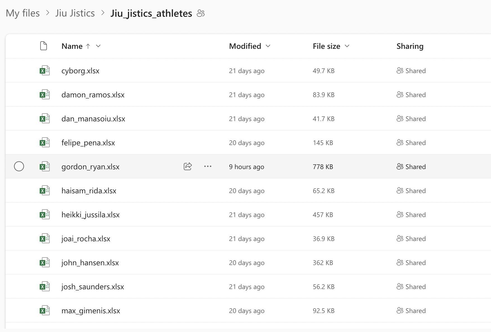

<h1> JIU JISTICS</h1>

<a href='https://jiujistics.netlify.app/'>Website</a>

Open Sourced Advanced Analytics and Stat Tracking for Jiu Jitsu

<h2>Links</h2>

<ul>
<li><a href='https://github.com/Andrew95496/void'>Discord</a></li>
<li><a href='https://www.overleaf.com/read/rmnjrykntwpt'>Stat Definitions PDF</a></li>
</ul>

<h2>Tech Stack</h2>

<ul>
<li><a href=''>VOID</a></li>
<li><a href='https://github.com/Andrew95496/cobra'>Cobra</a></li>
<li>Python</li>
<li>Pandas</li>
<li>TypeScript</li>
<li>React</li>
</ul>

<h2>One Drive</h2>

 Go to the Discord to get the link to the one drive to review the excel sheets for all of the athletes tracked so far.

<h2>Excel</h2>

A downloadable copy of the excel file template used for tracking stats is located in the `Stat_Sheets/` folder.

